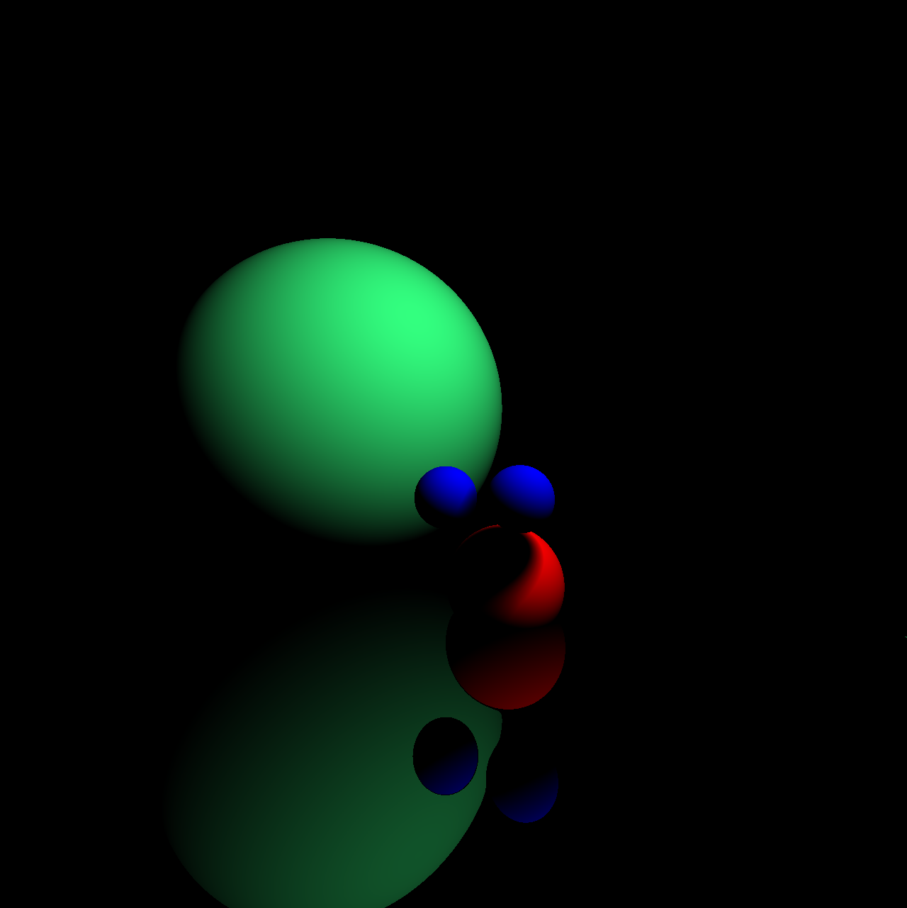

# PyOpenGL-RayMarcher

### Python implementation of the Ray Marching technique using OpenGL and Pygame

<br><br>

## Installation
### Dependencies
* PyOpenGl
* Pygame
* Numpy

### Setup
- Clone the repository
```sh
git clone https://github.com/TomValdant/PyOpenGL-RayMarcher
```
- Launch rayMarcher.py
```
python PyOpenGL-RayMarcher/src/raymarcher.py
```
